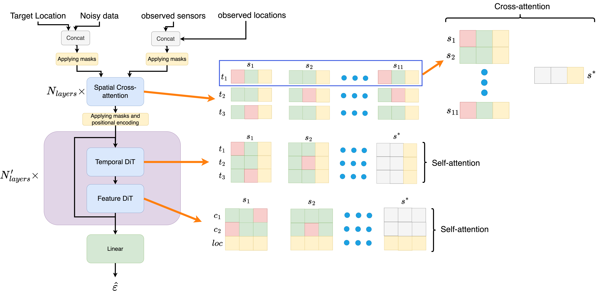

# DynaSTI: Diffusion-based Spatio-temporal Interpolation with Dynamic Sensor Sets

This repository is the official implementation of [Diffusion-based Spatio-temporal Interpolation with Dynamic Sensor Sets](). 



## Requirements

To install requirements:

```setup
pip install -r requirements.txt
```

## Dowload Dataset
Download the datasets from the following links and place them into the ./data/ folder into their corresponding folder structure like the follwoing.
```
.
|__data
|  |__awn
|  |__nacse
|  |__metr-la
|  |__pems_bay
```

### AWN 
link: https://kaggle.com/datasets/5360b79a41f57eadb7ceebc511d75e27d7d8172ab77f7a761fcda0f137ec51cc
### NACSE
link: https://kaggle.com/datasets/283729c988f4e6dadca9278352450915a7ad2298c914fc4d6e286e85547c204b
### METR-LA
link: https://kaggle.com/datasets/5d690adf41d43155c899914445a013c699652a9e38a57702f3aca0a2f0be7877
### PEMS-BAY
link: https://kaggle.com/datasets/10e48dbf4e88e07bed16bf4e5c02da633933d4700de0a2275a0659597c71fa0f
## Training & Evaluation

To train and evaluate the model(s) in the paper, run this command:

```train & evaluate
python exe_[dataset_name].py configs/config_[dataset_name].json
```


## Hyperparameter Setting

The hyperparameters are set in the config files in the ./configs/ folder
 


## Contributing

This repository is under the MIT License
